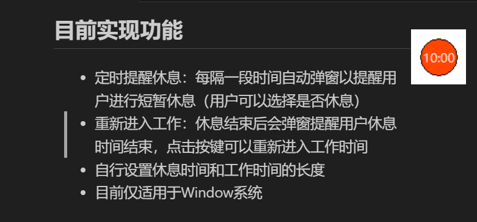
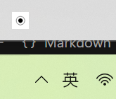

# Lightweight-Eye-Health-Protector

## 简要介绍
长时间使用电脑屏幕的用户常常会导致眼睛干涩等问题，20-20-20规则（每隔20分钟，眼睛离开屏幕，向20英尺（约合6米）以外的物体眺望，持续至少20秒）是一个很好的使用电脑屏幕的法则。本程序在经典规则基础上提供灵活的工作/休息时间设置，并具备以下特色：

## 核心功能
- ⏰ 智能计时提醒：工作/休息时间自动切换
- 🎨 视觉状态反馈：🔴 红色 - 工作中 | 🟢 绿色 - 休息中
- ⚙️ 个性化设置：
  - 工作时间（分钟）
  - 休息时间（秒）
  - 🚫🔔 声音提示开关
- 🛡️ 强制提醒机制：
  - 休息提醒窗口居中置顶
  - 无法通过关闭按钮跳过提醒
 
## 系统要求
- Windows 10/11（依赖系统声音服务）🚀

## 使用指南
### 首次启动
1. 安装依赖：
   ```bash
   pip install -r requirements.txt
   ```
2. 运行main.bat启动程序
3. 托盘图标说明：
  * 左键单击：暂无功能
  * 右键菜单：设置/退出

### 功能操作
- 软件启动后会在电脑上出现小弹球（可拖动），进入工作时间倒计时



- 倒计时结束后会弹出弹窗提示用户需要休息（可选择休息或不休息，不休息重新进入工作时间）


- 若选择不休息直接进入工作时间倒计时，选择进入休息则进入休息倒计时


- 休息时间结束后会弹出窗口，点击确认后重新进入工作状态


- 在托盘会出现软件图标，右键可以选择退出和设置


