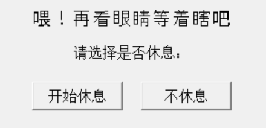
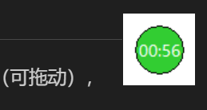

# Lightweight-Eye-Health-Protector

## 简要介绍
长时间使用电脑屏幕的用户常常会导致眼睛干涩等问题，20-20-20规则（每隔20分钟，眼睛离开屏幕，向20英尺（约合6米）以外的物体眺望，持续至少20秒）是一个很好的使用电脑屏幕的法则。然而，目前的一些软件可能功能有些太过复杂，因此我们写了个简单的护眼程序。

## 目前实现功能
- 定时提醒休息：每隔一段时间自动弹窗以提醒用户进行短暂休息（用户可以选择是否休息）
- 重新进入工作：休息结束后会弹窗提醒用户休息时间结束，点击按键可以重新进入工作时间
- 自行设置休息时间和工作时间的长度
- 目前仅适用于Window系统

## 如何使用
- 软件启动后会在电脑上出现小弹球（可拖动），进入工作时间倒计时

- 倒计时结束后会弹出弹窗提示用户需要休息（可选择休息或不休息，不休息重新进入工作时间）

- 若选择不休息直接进入工作时间倒计时，选择进入休息则进入休息倒计时

- 休息时间结束后会弹出窗口，点击确认后重新进入工作状态

- 在托盘会出现软件图标，右键可以选择退出和设置

## 如何启动
先确保requirement.txt的依赖包存在...
暂时先用选择点击bat启动吧... 还没打包...